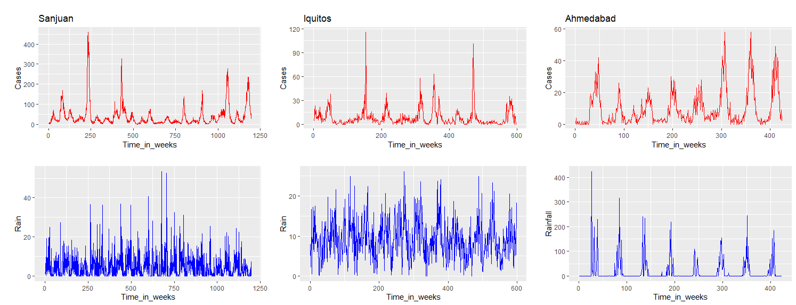

# Forcasting Dengue Outbreaks based on Climatic data
## A Google Data Analytics Professional Certificate Capstone Project Case Study
In this capstone project, we would like to analyze climatic dengue data from three different regions namely : San Juan, Iquitos, and Ahmedabad, to see how rainfall co-relates to dengue outbreak and explore different prediction models to forecast dengue outbreak based on climatic factors. These insights will be helpful for policy makers, caregivers, and hospital administrators to guide and allocate resources accordingly. 
## Ask

* What topic are we exploring?<br>
Ans: In this study, we am exploring the  dependency/relationship of dengue outbreaks on climatic factors.
* What is the problem we are trying to solve? <br>
Answer: our task is to predict the number of dengue cases each week (in each location) based on the climatic conditions and an understanding of the relationship between climate and dengue dynamics has been established in this study. This can improve research initiatives and resource allocation to help fight life-threatening epidemics with our proposed early warning system.
* What metrics will be used to measure our data to achieve our objective? <br>
Answer: Mean Squared Error between actual and predicted number of cases.
* Who are the stakeholders? <br>
Answer: Patients, Doctors, Policy makers, Caregivers, Hospital administrators
* Who is our audience? <br>
Answer: Policymakers, Caregivers
* How can our insights help our client make decisions? <br>
Answer: By allocating resources based on forecasting.

## Prepare 

### Data source: 

We analyze the data from a paper An ensemble neural network approach to forecast Dengue outbreak based on climatic condition: https://www.sciencedirect.com/science/article/pii/S0960077923000255. Climatic Dengue data is available on [Github](https://github.com/mad-stat/XEWNet/tree/main) in 3 CSV files. This study uses three multivariate time series datasets (weekly) to generate a short-term (26 weeks) and long-term (52 weeks) forecast of dengue incidence in the San Juan, Iquitos, and Ahmedabad regions

### Limitations
* Since we utilized data from three specific regions, it may not accurately reflect the characteristics of other regions.
* We're only looking at rainfall data, but there might be other weather and cultural factors that are important for predicting dengue outbreaks.
* 
## Process
* R is used to load, transform, analyzed and visualize data.
* As part of our data processing, we start by checking if any data files have empty entries.
* After that, we change the week number variable so that they always  it is monotounsly increasing over the years. For example:

```{r}
data_wk_iquitos <- data_iquitos %>% 
  mutate(Time_in_weeks= (Year-start_year)*number_of_weeks_in_a_year+Week)
```

## Analyze


**Figure 1:** depicts the incidence of Dengue cases (highlighted in red) and corresponding rainfall data (represented in blue) for San Juan, Iquitos, and Ahmedabad, with incidence rates per 10,000 population.
* We plotted dengue cases vs week and amount of rainfall vs week on top and bottom subplots respectively for three regions (Sanjuan, Iquitos, and Ahmedabad) in order to find the relationship between laboratory confirmed dengue cases and the amount of rainfall. Dengue cases (incidence per 10 000 population) are shown in red in the top row and rainfalls are shown in blue in the bottom row.
* The graphs show a clear link between rainfall and dengue cases in Ahmedabad. However, it's challenging to spot the same relationship in the other two regions.


**Figure 2:** examines the timing of most rainfalls throughout the year by overlaying data from multiple years onto a single annual scale on the top plot. Likewise, in the bottom plot, we employed a similar approach to identify the peak period of the year during which the influx of dengue cases is most pronounced.

* By looking at the above graph, it's evident that dengue cases increased shortly after heavy rainfall. For instance, in Ahmedabad, dengue cases peaked in week 40, about 5 to 6 weeks after the highest rainfall.
* Granger casuality test(GC test): The Granger causality test is a statistical hypothesis test used to determine whether one time series can predict another.
* We performed Granger casuality test between dengue cases and rainfall timeseries in order to find casual relationship between the two.

 **Table 1: Granger Causality Test Results for Cases Vs Rainfall in Different Regions**
  
|  Cases Vs Rainfall             | p-value Sanjuan       |p-value Iquitos       | p-value Ahmedabad    |
| ------------- | ------------- | ------------- | ------------- |
| GC test(order = 2)             | 0.005113      |0.2854         |0.01814        |
| GC test(order = 4)  | 0.02858  |0.0567  |4.244e^-11  |

* Looking at the table, we observed that GC is favorable for Sanjuan and Ahmedabad when the order is two. However, when the order is four, GC is favorable for all.

* **Train-Test data split for prediction:**
  - Length of Data:
        San Juan: 1196 observations covering the years 1991–2012.
        Iquitos: 598 observations covering the years 2002–2012.
        Ahmedabad: 424 observations covering the years 2005–2012.

  - Train and Test Split (Short-Term):
        For short-term analysis, the data is split into training and testing sets.
        San Juan: 1170 observations are used for training, and 26 observations are reserved for testing.
        Iquitos: 572 observations for training, and 26 for testing.
        Ahmedabad: 398 observations for training, and 26 for testing.

  - Train and Test Split (Long-Term):
        For long-term analysis, a different split is used.
        San Juan: 1144 observations for training, and 52 for testing.
        Iquitos: 546 observations for training, and 52 for testing.
        Ahmedabad: 372 observations for training, and 52 for testing.

In summary, the data for each location is initially divided into short-term and long-term periods. Then, within each period, the majority of the data is allocated to training, with a smaller portion set aside for testing. This division allows for the evaluation of models on both short-term and long-term trends in the data.

* The following table shows the prediction for 52 weeks of test data for three different models:


| Model            | Mean Absolute Error (Sanjuan)       |Mean Absolute Error (Iquitos)        | Mean Absolute Error (Ahmedabad)      |
| ------------- | ------------- | ------------- | ------------- |
| Polynomial Regression  (Degree = 2)             | 30.743      |7.367         |8.126       |
| Polynomial Regression  (Degree = 5)  |31.044  |7.381  |8.113  |
| Random Forest  |34.954  |8.99  |10.087  |

* These MAE values represent the average absolute differences between the predicted values from each model and the actual values for the respective locations. Lower MAE values indicate better predictive performance, suggesting that, based on MAE alone, the Polynomial Regression models with Degree = 2 and 5 perform better than the Random Forest model across all three locations.
  
## Act

## Share
