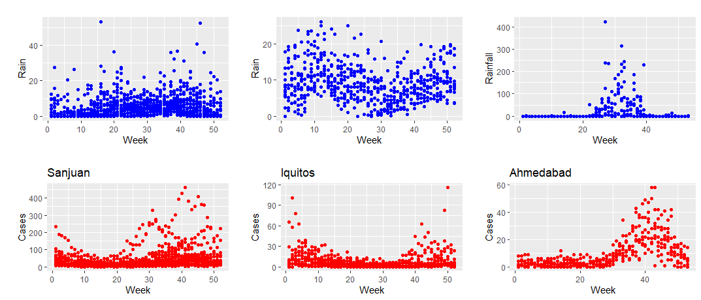

# Forcasting Dengue Outbreaks based on Climatic data
## A Google Data Analytics Professional Certificate Capstone Project Case Study
In this capstone project, we would like to analyze climatic dengue data from three different regions namely : San Juan, Iquitos, and Ahmedabad, to see how rainfall co-relates to dengue outbreak and explore different prediction models to forecast dengue outbreak based on climatic factors. These insights will be helpful for policy makers, caregivers, and hospital administrators to guide and allocate resources accordingly. 
## Ask

* What topic are we exploring?<br>
Ans: In this study, we am exploring the  dependency of dengue outbreaks on climatic factors.
* What is the problem we are trying to solve? <br>
Answer: our task is to predict the number of dengue cases each week (in each location) based on the climatic conditions and an understanding of the relationship between climate and dengue dynamics has been established in this study. This can improve research initiatives and resource allocation to help fight life-threatening epidemics with our proposed early warning system.
* What metrics will be used to measure our data to achieve our objective? <br>
Answer: Accuracy
* Who are the stakeholders? <br>
Answer: Patients, Doctors, Policy makers, Caregivers, Hospital administrators
* Who is our audience? <br>
Answer: Policymakers, Caregivers
* How can our insights help our client make decisions? <br>
Answer: By allocating resources based on forecasting.

## Prepare 

### Data source: 

We analyze the data from a paper An ensemble neural network approach to forecast Dengue outbreak based on climatic condition: https://www.sciencedirect.com/science/article/pii/S0960077923000255. Climatic Dengue data is available on [Github](https://github.com/mad-stat/XEWNet/tree/main) in 3 CSV files. This study uses three multivariate time series datasets (weekly) to generate a short-term (26 weeks) and long-term (52 weeks) forecast of dengue incidence in the San Juan, Iquitos, and Ahmedabad regions

### Limitations
* Since we utilized data from three specific regions, it may not accurately reflect the characteristics of other regions.
* We're only looking at rainfall data, but there might be other weather and cultural factors that are important for predicting dengue outbreaks.
* 
## Process
* R is used to load, transform, analyzed and visualize data.
* As part of our data processing, we start by checking if any data files have empty entries.
* After that, we change the week number variable so that they always  it is monotounsly increasing over the years. For example:

```{r}
data_wk_iquitos <- data_iquitos %>% 
  mutate(Time_in_weeks= (Year-start_year)*number_of_weeks_in_a_year+Week)
```

## Analyze


* We plotted dengue cases vs week and amount of rainfall vs week on top and bottom subplots respectively for three regions (Sanjuan, Iquitos, and Ahmedabad) in order to find the relationship between laboratory confirmed dengue cases and the amount of rainfall. Dengue cases (incidence per 10 000 population) are shown in red in the top row and rainfalls are shown in blue in the bottom row.
* The graphs show a clear link between rainfall and dengue cases in Ahmedabad. However, it's challenging to spot the same relationship in the other two regions.



* By looking at the above graph, it's evident that dengue cases increased shortly after heavy rainfall. For instance, in Ahmedabad, dengue cases peaked in week 40, about 5 to 6 weeks after the highest rainfall.
* Grainger casuality test(GC test):
* 
  
|  Cases Vs Rainfall             | Sanjuan       | Iquitos       |  Ahmedabad    |
| ------------- | ------------- | ------------- | ------------- |
| GC test(order = 2)             | 0.005113      |0.2854         |0.01814        |
| GC test(order = 4)  | 0.02858  |0.0567  |4.244e^-11  |
 
## Act

## Share
